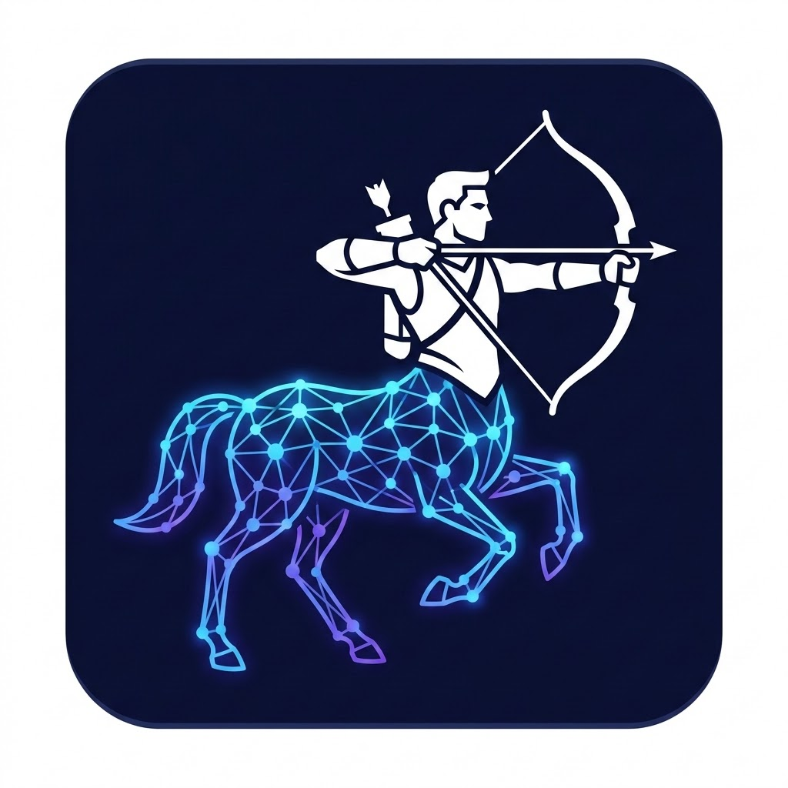
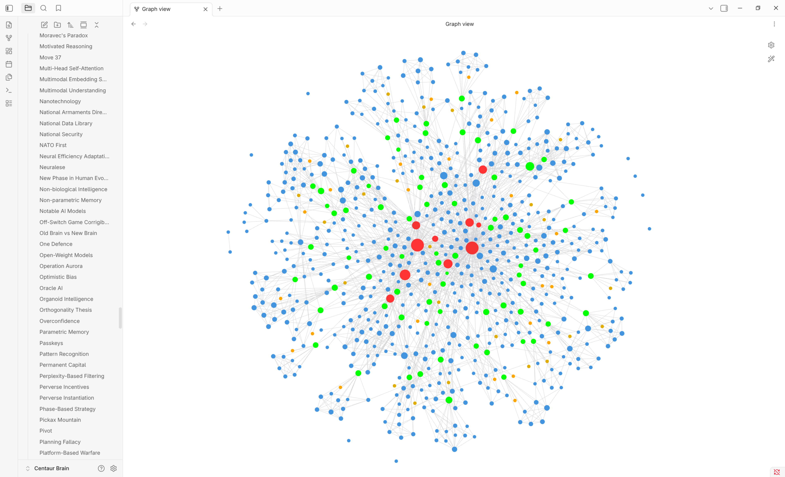
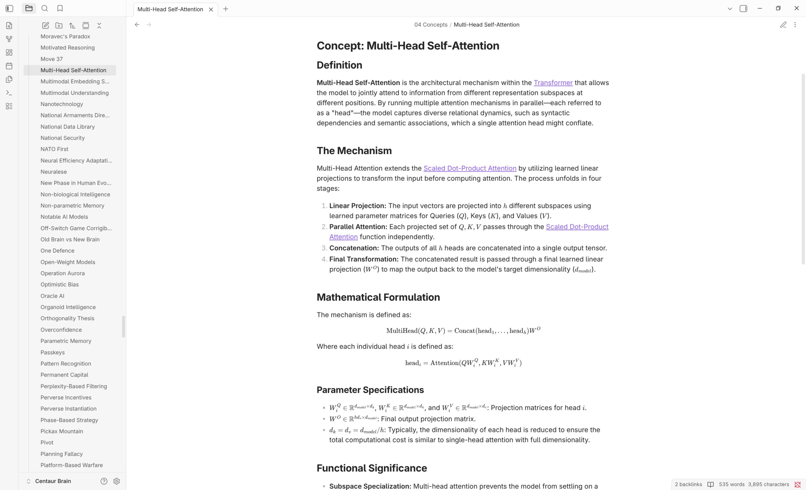
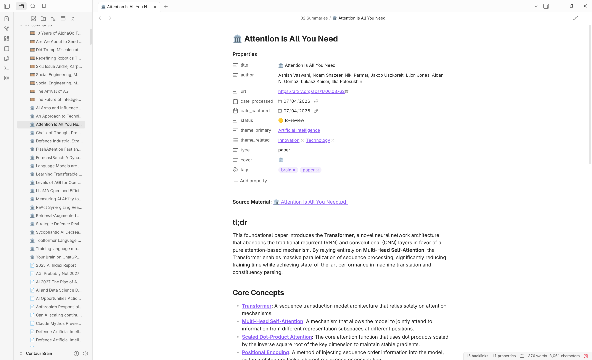

# 🧠 Centaur Brain



Centaur Brain is an agentic "Second Brain" system designed to bridge the gap between high-velocity information consumption (web, YouTube, PDFs) and permanent, structured knowledge in **Obsidian**.

Similar to Andrej Karpathy's vision of agentic workflows, it moves beyond simple "web clipping" to provide a multi-layered ontology extraction using the **Gemini 3.1 Flash Lite** model.

## 🖼️ Visual Showcase

### 🗺️ Knowledge Graph
The system automatically builds a dense, interconnected graph of high-value concepts.


### 🔍 Concept Synthesis
Detailed, LLM-curated concept pages that synthesize insights from multiple sources while preserving nuance.


### 📄 Source Summaries
Richly formatted summaries with metadata, primary/related themes, and core takeaways.


## 🏗️ Architecture

The solution consists of three primary components:

1.  **Chrome Extension:** A lightweight capture tool that extracts clean text from articles or triggers the backend to fetch transcripts from YouTube and process full PDFs.
2.  **FastAPI Backend:** A Python service that orchestrates the heavy lifting:
    *   Full-text extraction from multi-page PDFs.
    *   Strategic summarization using the Gemini API.
    *   **Proactive Deduplication:** Uses RAG (Retrieval-Augmented Generation) by injecting your existing concept dictionary into the prompt to prevent creating redundant synonyms during ingestion.
    *   API Throttling & Quota Management to respect free-tier limits.
3.  **Obsidian Vault:** The destination for all captured knowledge, structured into `Summaries`, `Atlas` (themes), and `Concepts`.

## 🚀 Key Features

*   **Full PDF Ingestion:** The backend processes every page of a document, ensuring deep analysis of long-form reports.
*   **Agentic Concept Mapping:** For every source ingested, the system identifies 5-15 highly specific concepts and automatically updates their dedicated pages in your vault with backlinks and contextual snippets.
*   **Mobile Ingestion Queue (Offline-Friendly):** Background watcher polls the `00 System/Inbox/` directory in your Obsidian vault. Using tools like Obsidian's *Remotely Save* plugin, you can save markdown files with URLs from your mobile browser or note-taker, and the backend will asynchronously ingest them on your laptop, scrape the targets, and link concepts without any manual input.
*   **Auto-Healing Brain Cleaner:** A maintenance script (`brain_cleaner.py`) that periodically scans your vault to:
    *   **Deduplicate & Merge:** Intelligently synthesizes overlapping concepts (e.g., "AI" vs "Artificial Intelligence") into single canonical pages while healing all links vault-wide.
    *   **Link Healing:** Automatically updates wikilinks and detects "orphaned" mentions to generate new concept pages.
    *   **Hash-based State Tracking:** Prevents redundant refactoring and "semantic smoothing" by only re-processing files that have actually changed since the last pass.
*   **Background Automation:** Includes a systemd user service for Linux (Fedora) users to keep the intelligence layer running persistently.

## 📱 Mobile Capture (Offline-Friendly Queue)

You can capture content on your mobile phone and sync it back to your vault using standard community plugins (e.g., **Remotely Save**).

### How it Works:
1. When you share a URL on your phone (e.g., via Obsidian Mobile or by creating a note directly), create a new Markdown note in the `00 System/Inbox/` directory of your vault.
2. In the note content, simply include the URL (e.g., `https://example.com/some-article`). You can also include additional text or notes in the file, and name the file descriptively (e.g., `Capture - Super Interesting Article.md`).
3. The backend scans `00 System/Inbox/` every 15 seconds:
   - **Success:** Extracts the URL, scrapes and processes the content (including YouTube transcripts, PDFs, or standard pages), builds a structured summary in `02 Summaries/`, synthesizes concepts in `04 Concepts/`, and deletes the inbox file automatically.
   - **Failure:** If ingestion fails (e.g., network error, DNS resolution failure), the file is moved to `00 System/Inbox/Failed/[Failed] - Original Name.md` with an error prefix to prevent infinite processing loops.

## 🛠️ Installation

### 1. Prerequisites
*   [uv](https://github.com/astral-sh/uv) (The extremely fast Python package manager)
*   A Google AI Studio API Key (Free tier supported)
*   Obsidian installed locally

### 2. Backend Setup
```bash
cd backend
cp .env.example .env
# Edit .env with your GEMINI_API_KEY and OBSIDIAN_VAULT_PATH
uv run main.py
```

### 3. Extension Setup
1.  Open Chrome and navigate to `chrome://extensions/`.
2.  Enable **Developer mode**.
3.  Click **Load unpacked** and select the `extension/` folder from this repository.

### 4. Background Service (Linux/Fedora)
To run the backend automatically on login:
```bash
# 1. Edit centaur-brain.service to match your absolute paths (CWD & uv)
# 2. Copy it to your user systemd directory:
mkdir -p ~/.config/systemd/user/
cp centaur-brain.service ~/.config/systemd/user/
# 3. Enable and start the service
systemctl --user daemon-reload
systemctl --user enable centaur-brain.service
systemctl --user start centaur-brain.service
```

## 🧹 Maintenance & Utilities

### Brain Cleaner
Keep your graph clean and your concepts synthesized:
```bash
cd backend
# Runs deduplication, link healing, and refactoring with quota safety
uv run brain_cleaner.py
```

### Other Utilities
These scripts are available in the `backend/` directory for specific tasks:
*   **`add_book.py`**: Interactively add book metadata and a summary to your vault.
*   **`reindex_covers.py`**: Scans all source materials and attempts to fetch or update their cover images.

## 🛡️ Privacy & Security

*   The system operates **locally first**. Your raw document text is only sent to the Gemini API for analysis; it is never stored on a third-party server other than your local machine and your chosen LLM provider.
*   `.env` files and local source lists (`sources_all.txt`) are ignored by Git to prevent credential leakage.

## 📜 License

This project is licensed under the MIT License - see the [LICENSE](LICENSE) file for details.
